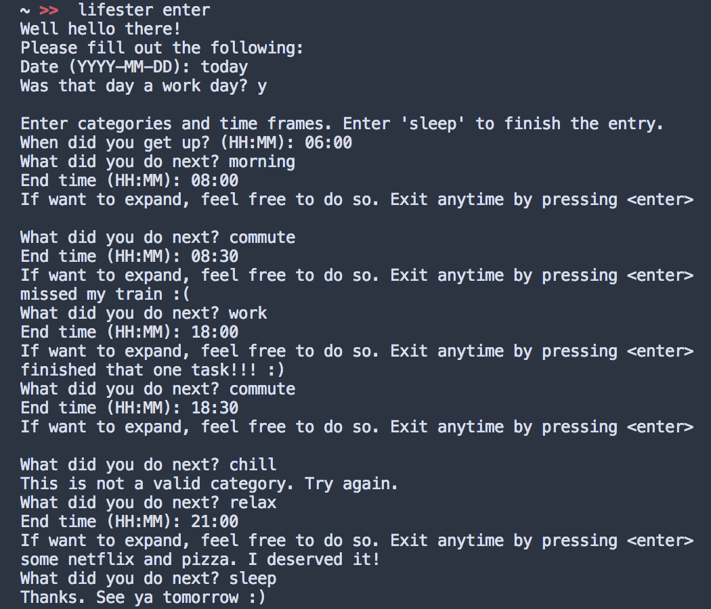

# lifester
> Every minute of your life. On the command line.

[](https://github.com/sophieau/lifester/releases)
[](https://pypi.python.org/pypi/lifester)

[](https://github.com/SophieAu/lifester/issues)
[](https://github.com/SophieAu/lifester/blob/master/LICENSE)


lifester is a command line tool to track every miute of your life. Enter your schedule for the day and then analyze how much time you spent on things.

[Installation](#installation) | [Setup](#setup) | [Usage](#usage) | [Troubleshooting](#troubleshooting) | [Credits](#credits)


## Installation

lifester is available on [PyPI](https://pypi.python.org/pypi/lifester). This is the easiest way to install it. All dependencies will be installed automatically.

```sh
pip3 install lifester
```

If you want to install lifester from source, have a look [here](#install-from-source).


## Setup
No further setting up needed. The first time you run lifester, it will create a ``.lifester`` directory in your home folder (if it does not already exist) and create a ``categories.txt`` file which saves all the categories your time blocks can have.


## Usage
```
Usage:
    lifester enter
    lifester analyze all
    lifester analyze (year | month | week) <timeframe>
    lifester categories (add)
    lifester help
    lifester version

Timeframe:
    ... start end [year]
    ... single [year]
```

Lifester creates a `.lifester` folder in your home directory (`~/`) where it saves all entered day data as well as a categories file. If you want to specify a different folder for these files, you need to set the `LIFESTERPATH` in your `.bashrc` like so:

    export LIFESTERPATH=/path/that/you/want

### Entering the Data For a Day


### Analyzing Previously Entered Data


Of course, subsituting `year` with `month` and `week` works too.

### Showing / Adding Categories


## Troubleshooting

#### Bug Reports and Feature Requests
Bug reports and feature requests are very much appreciated. Please contact me on Twitter ([@SolviAu](https://twitter.com/solviau)) or open an issue [here](https://github.com/SophieAu/lifester/issues/new).


## Credits
This project was inspired by Cal Newport and how he organizes and plans his days. This is probably the most crucial blog posts of his:
* [Deep Habits: The Importance of Planning Every Minute of Your Work Day](http://calnewport.com/blog/2013/12/21/deep-habits-the-importance-of-planning-every-minute-of-your-work-day/)

---
> [sophieau.github.io](https://sophieau.github.io) – Twitter [@SolviAu](https://twitter.com/solviau) – © 2018, [MIT Licence](LICENSE)
